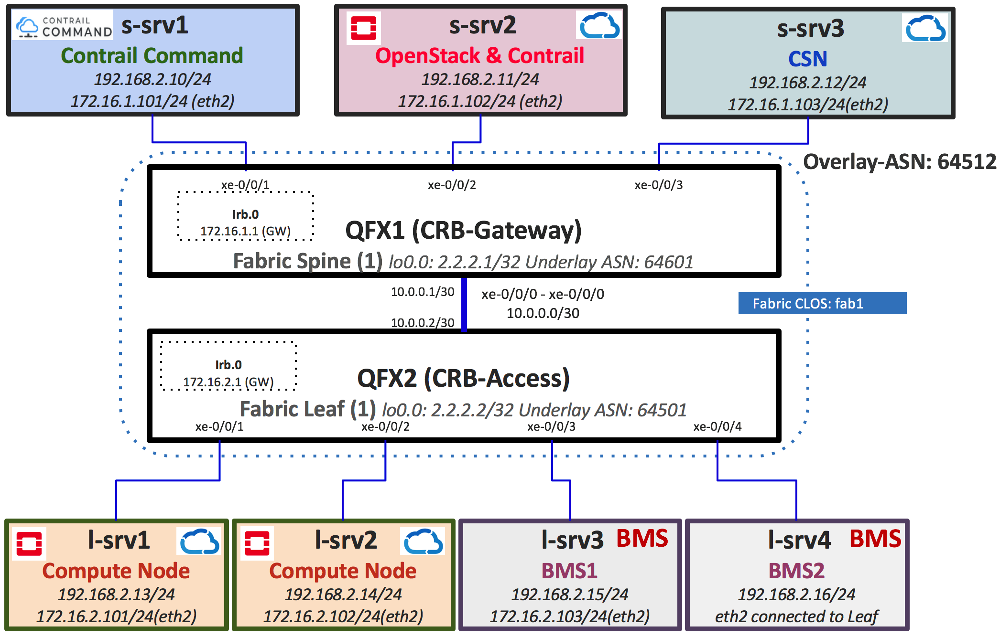

#  Contrail Enterprise Multi-Cloud Use-cases Documents

This repo is created to capture CEM use-cases provisioning flow and steps by steps instructions. Here is setup topology diagram used during testing.

## Use-cases

* ### [UC-01-Contrail_Command_Installtion](docs/01-Install-Contrail-Command.md)

* ### [UC-02-Contrail_Cloud_Cluster_Provisioning](docs/02-Contrail-Cloud-Cluster-Provisioning.md)

* ### [UC-03-Fabric_Creation_Discovery_Onboarding](docs/03-Fabric-Creation-Discovery-Config.md)

* ### [UC-04-Intra_VN_BMS_VM](docs/04-BMS-VM-Intra-VN.md)

* ### [UC-05-Inter_VNs_BMS_VM](docs/05-BMS-VM-Inter-VN.md)

* ### [UC-06-BM_SecurityGroups](docs/06-BMS-Security.md)

### References

* <https://github.com/Juniper/contrail-ansible-deployer/wiki>
* <https://github.com/Juniper/contrail-command-deployer/wiki/Using-Ansible-to-launch-the-Contrail-Command-Containers>
* <https://github.com/qarham/cfm-vagrant>